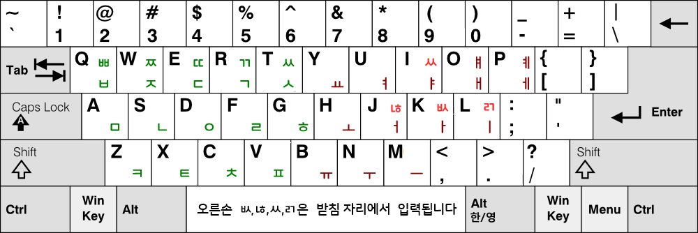

# 두겹이 자판 (Dugyeob-e Keyboard)

## 일반 설명 링크

이 문서는 개발자를 위한 문서입니다.
일반 사용자를 위한 두겹이 자판의 설명과 사용법은 다음 링크에서 보실 수 있습니다.

- 자판 설명: https://blog.naver.com/eekdland/224142632310

---

## 개요

두겹이 (두벌식 겹받침 e) 자판은 표준 두벌식과 [두벌식 겹받침](https://cafe.daum.net/3bulsik/6CY8/341) 자판을 기반으로,
겹받침과 확장 입력을 보다 자연스럽게 입력할 수 있도록 개선한 한글 자판입니다.

기존 두벌식은 익숙하고 배우기 쉽지만,
겹받침이나 확장 입력에서 Shift 및 연속 입력 부담이 커지는 문제가 있습니다.

두겹이 자판은 이러한 문제를 줄이기 위해:

- 자주 사용하는 겹받침 입력 단순화
- Shift 의존 감소
- 입력 흐름 단순화

를 목표로 설계되었습니다.

---

## 배열도

  

---

## 특징

### 1. 표준 두벌식 기반

기존 두벌식 사용자도 비교적 쉽게 적응할 수 있도록,
기본 구조는 표준 두벌식을 최대한 유지했습니다.

---

### 2. 겹받침 입력 개선

다음과 같은 겹받침 입력을 보다 간단하게 처리할 수 있습니다.

- ㄶ
- ㅄ
- ㄺ
- ㅆ 종성
- 기타 확장 조합

위 겹받침들은 초성과 중성을 입력하면 I, J, K, L 자판이 겹받침 ㅆ, ㄶ, ㅄ, ㄺ로 일시적으로 자동으로 변경됩니다.

다만 이중모음과의 충돌을 막기 위해 이중모음이 우선적으로 작동됩니다.

---

### 3. Shift 부담 감소

기존 Shift 기반 입력 대신
'두벌식 겹받침' 자판의 신세벌식 입력 구조를 차용하고,
Shift Lock 기능을 사용하여 시프트를 누르고 있지 않고도
윗글쇠를 입력할 수 있습니다.

이러한 방식은 기존의 “동시 유지형 modifier”보다
입력 흐름을 단순하게 만들 가능성이 있습니다.

---

### 4. 실험적 입력 구조

두겹이 자판은 단순 배열 변경뿐 아니라,
한글 입력 구조 자체를 실험하는 프로젝트이기도 합니다.

특히:

- 평균 피로 감소
- 가위질(scissor) 패턴 감소
- 입력 흐름 단순화

를 중요한 목표로 두고 있습니다.

| 자판 이름 |	평균 피로 (손 이동) |	평균 피로 (글쇠) |	평균 피로 (손 꼬임) |	평균 피로 (가위질 패턴) | 손가락 분산 패널티 |	총 피로 (자모에 대한 평균) |
| --- | --- | --- | --- | --- | --- | --- |
| 두벌식 표준 |	0.3820 | 0.8661 |	1.0909 | 0.2152 |	0.0046 |	2.6867 |
| 두벌식 박영효-송계범 |	0.3554 | 0.8408 |	1.0876 | 0.1743 |	0.0372 |	2.6184 |
| 두벌식 겹받침 e |	0.3311 |	0.8312 |	1.1139 | 0.2035 |	0.0056 |	2.5778 |
| 두벌식 겹받침 e (부가기능 사용) |	0.2837 |	0.8060 |	1.1120 | 0.1987 |	0.0056 |	2.4956 |

이외에도 실험적인 부가기능인 시프트 락, 대체시프트 식 순아래 입력, 기호 확장, 약어 확장 등을 지원하고 있습니다.

---

## 프로젝트 상태

현재 두겹이 자판은 지속적으로 개선 중입니다.

자판 배열 및 입력 방식은
실사용 피드백과 분석 결과를 바탕으로 변경될 수 있습니다.

---

## 개발자를 위한 규격

두겹이 자판의 기본 버전은 다음 요소들을 필수로 포함합니다:

- 표준 두벌식 배열
- 겹받침 확장 (i, j, k, l 글쇠를 겹받침 입력 상태로 일시 전환)
- 겹받침 및 이중모음 모아치기 (낱자 결합을 일반 및 역순으로 지원)

따라서 부가기능 포함 버전 등 파생 구현체들은,

기본 버전의 규격을 유지한 상태에서 추가 기능을 선택적으로 포함할 수 있습니다.

추가 기능의 예시는 다음과 같습니다:

- 대체 시프트 기반 순아래 입력
- 시프트 락
- 기호 확장
- 약어 기능

---

## 두겹이 자판 모아치기에 대하여

해당 부분에 대해서는 [링크](https://github.com/Sinseiki/Dubeolsik_Moachigi)를 참고하시기 바랍니다.

---

## 참고 사항

두겹이 자판은 단순한 “새 배열”이 아니라,
실제 입력 피로와 입력 흐름을 개선하기 위한 프로젝트입니다.

또한 이 자판과 저장소는 공공성을 위하고 독점화를 막기 위해 [CC BY-SA 4.0](https://creativecommons.org/licenses/by-sa/4.0/legalcode.ko) 라이선스로 공개되어 있습니다.

또한 원칙은 아니지만, 다른 곳에 소개하실 때 ssgi.kr 를 함께 표시해주시면 감사드리겠습니다.

본 자판 XML 파일은 날개셋 입력기의 설정 형식을 사용합니다.

날개셋 입력기 자체의 저작권은 제작자 [김용묵](http://moogi.new21.org) 님께 있습니다.

---

## 연관 자판 프로젝트

이 저장소들은 한국어 및 영어 키보드 배열 및 타자 인체공학에 관하여 진행 중인 연구 프로젝트의 일부입니다.

| 이름 | 설명 |
| --- | --- |
| [세벌식 모아치기 e (세모이)](https://github.com/Sinseiki/Semo-e_keyboard) | 입력을 압축하는 준속기 자판 |
| [두벌식 줄맞춤 e (두줄이)](https://github.com/Sinseiki/Dujul-e_keyboard) | 표준 두벌식 응용 효율 개선 자판 |
| [**두벌식 겹받침 e (두겹이)**](https://github.com/Sinseiki/Dugyeob-e_keyboard) | **표준 두벌식 배열 기반 개선 자판** |
| [두벌식 자판 모아치기](https://github.com/Sinseiki/Dubeolsik_Moachigi) | 두벌식 자판의 모아치기 연구 |
| [세벌식 ROS-e (ROSE)](https://github.com/Sinseiki/ros-e_keyboard) | 영어 모아치기 및 순서 교정 자판 |
| [타자 피로도 분석기](https://github.com/Sinseiki/typing-fatigue-analyzer) | 자판 연구를 위한 타자 피로도 분석 도구 |

※ 타자 피로도 분석기는 [Hyunjun Ji](https://github.com/isty2e) 님의 분석기를 기반으로 연구 및 수정되었습니다.